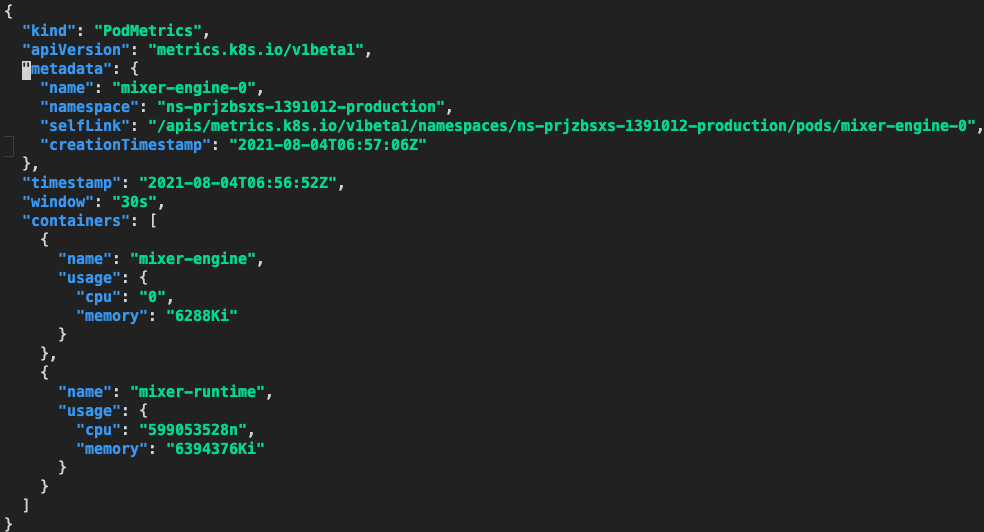

# kubectl 速查手册

## 使用 kubectl get --raw

### 获取节点 cadvisor 指标

```bash
kubectl get --raw=/api/v1/nodes/11.185.19.215/proxy/metrics/cadvisor

# 查看有哪些指标名
kubectl get --raw=/api/v1/nodes/11.185.19.215/proxy/metrics/cadvisor | grep -v "#" | awk -F '{' '{print $1}' | awk '{print $1}' | sort | uniq
```

### 获取 node-exporter pod 指标

```bash
kubectl get --raw=/api/v1/namespaces/monitoring/pods/node-exporter-n5rz2:9100/proxy/metrics
```

### 获取节点 summary 数据

```bash
kubectl get --raw=/api/v1/nodes/11.185.19.21/proxy/stats/summary
```

### 测试 Resource Metrics API

获取指定 namespace 下所有 pod 指标:

```bash
kubectl get --raw "/apis/metrics.k8s.io/v1beta1/namespaces/ns-prjzbsxs-1391012-production/pods/"
```


获取指定 pod 的指标:

```bash
kubectl get --raw "/apis/metrics.k8s.io/v1beta1/namespaces/ns-prjzbsxs-1391012-production/pods/mixer-engine-0"
```



## Node 相关

### 表格输出各节点占用的 podCIDR

``` bash
$ kubectl get no -o=custom-columns=INTERNAL-IP:.metadata.name,EXTERNAL-IP:.status.addresses[1].address,CIDR:.spec.podCIDR
INTERNAL-IP     EXTERNAL-IP       CIDR
10.100.12.194   152.136.146.157   10.101.64.64/27
10.100.16.11    10.100.16.11      10.101.66.224/27
```

### 表格输出各节点总可用资源 (Allocatable)

``` bash
$ kubectl get no -o=custom-columns="NODE:.metadata.name,ALLOCATABLE CPU:.status.allocatable.cpu,ALLOCATABLE MEMORY:.status.allocatable.memory"
NODE       ALLOCATABLE CPU   ALLOCATABLE MEMORY
10.0.0.2   3920m             7051692Ki
10.0.0.3   3920m             7051816Ki
```

### 输出各节点已分配资源的情况

所有种类的资源已分配情况概览：

``` bash
$ kubectl get nodes --no-headers | awk '{print $1}' | xargs -I {} sh -c "echo {} ; kubectl describe node {} | grep Allocated -A 5 | grep -ve Event -ve Allocated -ve percent -ve --;"
10.0.0.2
  Resource           Requests          Limits
  cpu                3040m (77%)       19800m (505%)
  memory             4843402752 (67%)  15054901888 (208%)
10.0.0.3
  Resource           Requests   Limits
  cpu                300m (7%)  1 (25%)
  memory             250M (3%)  2G (27%)
```

表格输出 cpu 已分配情况:

``` bash
$ kubectl get nodes --no-headers | awk '{print $1}' | xargs -I {} sh -c 'echo -ne "{}\t" ; kubectl describe node {} | grep Allocated -A 5 | grep -ve Event -ve Allocated -ve percent -ve -- | grep cpu | awk '\''{print $2$3}'\'';'
10.0.0.10	460m(48%)
10.0.0.12	235m(25%)
```

表格输出 memory 已分配情况:

``` bash
$ kubectl get nodes --no-headers | awk '{print $1}' | xargs -I {} sh -c 'echo -ne "{}\t" ; kubectl describe node {} | grep Allocated -A 5 | grep -ve Event -ve Allocated -ve percent -ve -- | grep memory | awk '\''{print $2$3}'\'';'
10.0.0.10	257460608(41%)
10.0.0.12	59242880(9%)
```

### 查看节点可用区分布情况

```bash
$ kubectl get nodes -o=jsonpath='{range .items[*]}{.metadata.name}{"\t"}{.metadata.labels.failure-domain\.beta\.kubernetes\.io\/zone}{"\n"}{end}'
10.83.96.127    100004
10.83.96.132    100004
10.83.96.139    100004
10.83.96.8      100004
10.83.96.93     100004
```

## Pod 相关

### 清理 Evicted 的 pod

``` bash
kubectl get pod -o wide --all-namespaces | awk '{if($4=="Evicted"){cmd="kubectl -n "$1" delete pod "$2; system(cmd)}}'
```

### 清理非 Running 的 pod

``` bash
kubectl get pod -o wide --all-namespaces | awk '{if($4!="Running"){cmd="kubectl -n "$1" delete pod "$2; system(cmd)}}'
```

### 升级镜像

``` bash
export NAMESPACE="kube-system"
export WORKLOAD_TYPE="daemonset"
export WORKLOAD_NAME="ip-masq-agent"
export CONTAINER_NAME="ip-masq-agent"
export IMAGE="ccr.ccs.tencentyun.com/library/ip-masq-agent:v2.5.0"
```

``` bash
kubectl -n $NAMESPACE patch $WORKLOAD_TYPE $WORKLOAD_NAME --patch '{"spec": {"template": {"spec": {"containers": [{"name": "$CONTAINER_NAME","image": "$IMAGE" }]}}}}'
```