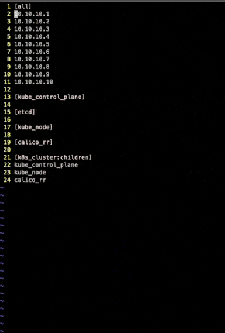

# 使用 kubespray 搭建集群

## 原理

[kubespray](https://github.com/kubernetes-sigs/kubespray) 是利用 [ansible](https://docs.ansible.com/ansible/latest/index.html) 这个工具，通过 SSH 协议批量让指定远程机器执行一系列脚本，安装各种组件，完成 K8S 集群搭建。

## 准备工作

下载 kubespray 并拷贝一份配置:

```bash
# 下载 kubespray
$ git clone --depth=1 https://github.com/kubernetes-sigs/kubespray.git
$ cd kubespray
# 安装依赖，包括 ansible
$ sudo pip3 install -r requirements.txt

# 复制一份配置文件
cp -rfp inventory/sample inventory/mycluster
```

## 修改配置

### 集群网络

修改配置文件 `inventory/mycluster/group_vars/k8s_cluster/k8s-cluster.yml`:

```yaml
# 选择网络插件，支持 cilium, calico, weave 和 flannel
kube_network_plugin: cilium

# 设置 Service 网段
kube_service_addresses: 10.233.0.0/18

# 设置 Pod 网段
kube_pods_subnet: 10.233.64.0/18
```

其它相关配置文件: `inventory/mycluster/group_vars/k8s_cluster/k8s-net-*.yml`。

### 运行时

修改配置文件 `inventory/mycluster/group_vars/k8s_cluster/k8s-cluster.yml`:

```yaml
# 支持 docker, crio 和 containerd，推荐 containerd.
container_manager: containerd

# 是否开启 kata containers
kata_containers_enabled: false
```

其它相关配置文件:

```txt
inventory/mycluster/group_vars/all/containerd.yml
inventory/mycluster/group_vars/all/cri-o.yml
inventory/mycluster/group_vars/all/docker.yml
```

### 集群证书

修改配置文件 `inventory/mycluster/group_vars/k8s_cluster/k8s-cluster.yml`:

```yaml
# 是否开启自动更新证书，推荐开启。
auto_renew_certificates: true
```

## 准备机器列表

拿到集群部署的初始机器内网 ip 列表，修改 `inventory/mycluster/inventory.ini`:

```ini
[all]
master1 ansible_host=10.10.10.1
master2 ansible_host=10.10.10.2
master3 ansible_host=10.10.10.3
node1 ansible_host=10.10.10.4
node2 ansible_host=10.10.10.5
node3 ansible_host=10.10.10.6
node4 ansible_host=10.10.10.7
node5 ansible_host=10.10.10.8
node6 ansible_host=10.10.10.9
node7 ansible_host=10.10.10.10

[kube_control_plane]
master1
master2
master3

[etcd]
master1
master2
master3

[kube_node]
master1
master2
master3
node1
node2
node3
node4
node5
node6
node7

[calico_rr]

[k8s_cluster:children]
kube_control_plane
kube_node
calico_rr
```

**注:** 务必使用 `ansible_host` 标识节点内网 IP，否则可能导致出现类似 [这个issue](https://github.com/kubernetes-sigs/kubespray/issues/5949) 的问题。

附上 vim 编辑 inventory，批量加机器的技巧:



## 国内环境安装

在国内进行安装时，会因 GFW 影响而安装失败，参考 [kubespray 离线安装配置](offline.md)。

## 部署集群

```bash
ansible-playbook -i inventory/mycluster/inventory.ini --private-key id_rsa --user=ubuntu --become --become-user=root cluster.yml
```

## 获取 kubeconfig

部署完成后，从 master 节点上的 `/root/.kube/config` 路径获取到 kubeconfig，这里以 ansible 的 fetch 功能为例，将 kubeconfig 拷贝下来:

```bash
$ ansible -i '10.10.6.9,' -b -m fetch --private-key id_rsa --user=ubuntu -a 'src=/root/.kube/config dest=kubeconfig flat=yes' all
[WARNING]: Skipping callback plugin 'ara_default', unable to load
10.10.6.9 | CHANGED => {
    "changed": true,
    "checksum": "190eafeead70a8677b736eaa66d84d77c4a7f8be",
    "dest": "/root/kubespray/kubeconfig",
    "md5sum": "ded532f68930c48a53b3b2144b30f7f5",
    "remote_checksum": "190eafeead70a8677b736eaa66d84d77c4a7f8be",
    "remote_md5sum": null
}
```

> `-i` 中的逗号是故意的，意思是不让 ansible 误以为是个 inventory 文件，而是解析为单个 host。

获取到 kubeconfig 后，可以修改其中的 server 地址，将 `https://127.0.0.1:6443` 改为非 master 节点可以访问的地址，最简单就直接替换 `127.0.0.1` 成其中一台 master 节点的 IP 地址，也可以在 Master 前面挂个负载均衡器，然后替换成负载均衡器的地址。