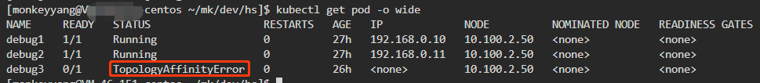

# Pod 绑定 NUMA 亲和性

## 前提条件

* 内核启用 NUMA: 确保 `/etc/default/grub` 中没有 `numa=off`，若有就改为 `numa=on`。
* k8s 1.18 版本以上 (依赖特性 TopologyManager 在 1.18 进入 beta 默认开启)。

## 启用方法

增加 kubelet 参数:
* `--cpu-manager-policy=static`
* `--topology-manager-policy=single-numa-node`

## 验证 NUMA 亲和性

1. 确认节点CPU 分布情况：

```txt
NUMA node0 CPU(s):     0-23,48-71
NUMA node1 CPU(s):     24-47,72-95
```


2. 先后创建三个static类型（request和limit严格一致）的Pod：

```txt
debug1： CPU request==limit==40C
debug2： CPU request==limit==40C
debug3： CPU request==limit==10C
```

实验预期：
* debug1与debug2分布在不同的numa上，各自占用40C CPU资源，numa1与numa2各自剩余8C。
* debug3预期需要10C并且都在一个numa上，在debug1和debug2各自占用40C的情况下，总共剩余16C CPU，但每个numa剩余8C<10C，debug3必定调度失败。

3. 验证
   debug1上创建40个100%使用CPU的进程，查看进程分布情况：debug1全部分布在numa0上:


同样，debug2全部分布在numa1上。

debug3由于没有numa满足>=10C，调度失败。




## 确保Pod内的进程在本numa分配内存

本质上是通过系统调用(set_mempolicy)设置进程属性,在内核给进程分配内存时，内核只在进程所属numa分配内存。如果业务进程本身没有明显调用set_mempolicy设置内存分配策略，可以通过numactl --localalloc cmd 启动的进程，内核分配内存时会严格保证内存分布在本numa

## 参考资料

* https://docs.qq.com/doc/DSkNYQWt4bHhva0F6
* https://blog.csdn.net/nicekwell/article/details/9368307
* [为什么 NUMA 会影响程序的延迟](https://draveness.me/whys-the-design-numa-performance/)
