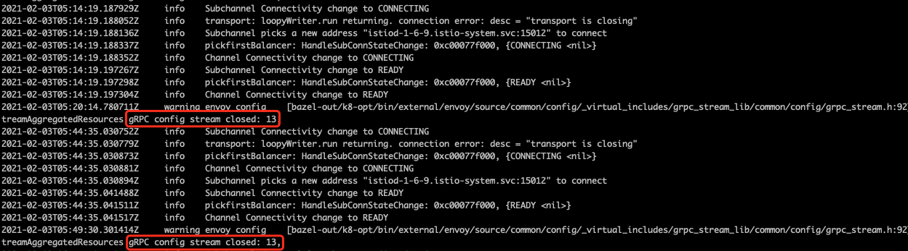

# Envoy 报错: gRPC config stream closed

## gRPC config stream closed: 13

这通常是正常的，因为控制面(istiod)默认每 30 分钟强制断开 xDS 连接，然后数据面(proxy)再自动重连。

## gRPC config stream closed: 14

如果只出现一次，通常是在 envoy 启动或重启时报这个错，没什么问题；但如果反复报这个错，可能是数据面(proxy)连接控制面(istiod)有问题，需要排查下。

## 参考资料

* [Istio Common Issues](https://github.com/istio/istio/wiki/Troubleshooting-Istio#common-issues)