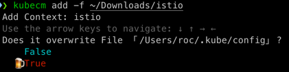
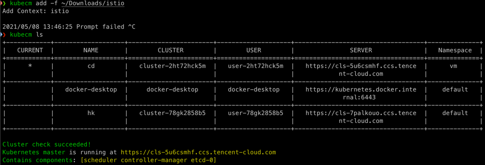
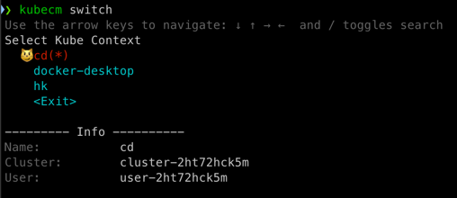

# 使用 kubecm 合并 kubeconfig

Kubernetes 提供了 kubectl 命令行工具来操作集群，使用 kubeconfig 作为配置文件，默认路径是 `~/.kube/config`，如果想使用 kubectl 对多个集群进行管理和操作，就在 kubeconfig 中配置多个集群的信息即可，通常可以通过编辑 kubeconfig 文件或执行一堆 `kubectl config` 的命令来实现。

一般情况下，Kubernetes 集群在安装或创建好之后，都会生成 kubeconfig 文件，如何简单高效的将这些 kubeconfig 合并以便让我们通过一个 kubeconfig 就能方便的管理多集群呢？我们可以借助 [kubecm](https://github.com/sunny0826/kubecm) 这个工具，本文将介绍如何利用 `kubecm` 来实现多集群的 kubeconfig 高效管理。

## 安装 kubecm

首先需要在管理多集群的机器上安装 `kubecm`，安装方法参考 [官方文档](https://kubecm.cloud/#/zh-cn/install) 。

## 使用 kubecm 添加访问凭证到 kubeconfig

首先拿到你集群的 kubeconfig 文件，将其重命名为你想指定的 context 名称，然后通过下面的命令将 kubeconfig 信息合并到 `~/.kube/config`:

``` bash
kubecm add -f <file>
```



> 提示是否覆盖默认 kubeconfig 文件，方向键选择 `True` 然后回车即可。

## 查看集群列表

通过 `kubecm` 添加了要管理和操作的集群后，通过 `kubecm ls` 可查看 kubeconfig 中的集群列表 (星号标识的是当前操作的集群):



## 切换集群

当想要切换到其它集群操作时，可使用 `kubecm switch` 进行交互式切换:



不过还是推荐使用 kubectx 进行切换。

## 移除集群

如果想要移除某个集群，可以用 `kubecm delete <context>`:

