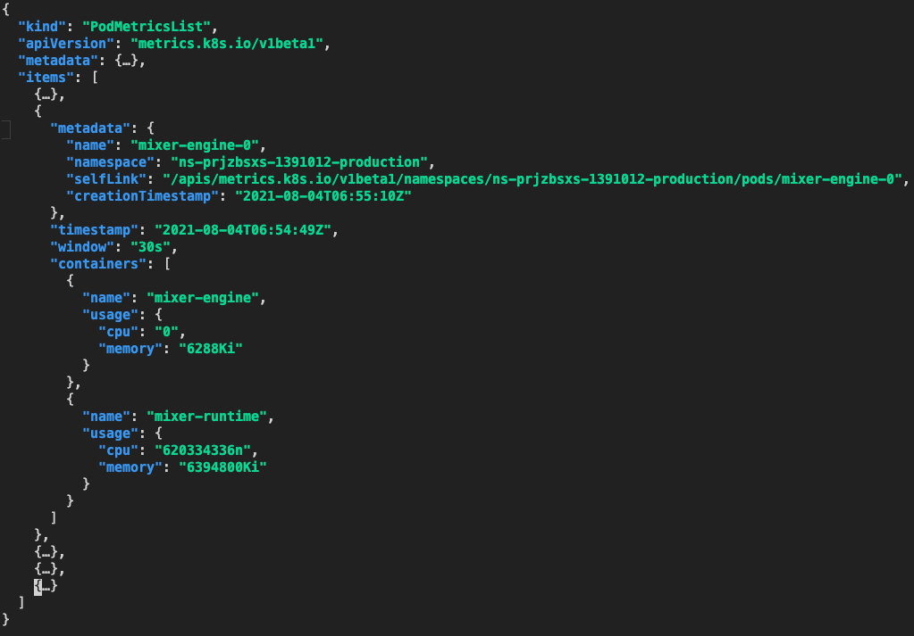

# 使用 kubectl get --raw

## 获取节点 cadvisor 指标

```bash
kubectl get --raw=/api/v1/nodes/11.185.19.215/proxy/metrics/cadvisor

# 查看有哪些指标名
kubectl get --raw=/api/v1/nodes/11.185.19.215/proxy/metrics/cadvisor | grep -v "#" | awk -F '{' '{print $1}' | awk '{print $1}' | sort | uniq
```

## 获取节点 summary 数据

```bash
kubectl get --raw=/api/v1/nodes/11.185.19.21/proxy/stats/summary
```

## 测试 Resource Metrics API

获取指定 namespace 下所有 pod 指标:

```bash
kubectl get --raw "/apis/metrics.k8s.io/v1beta1/namespaces/ns-prjzbsxs-1391012-production/pods/"
```



获取指定 pod 的指标:

```bash
kubectl get --raw "/apis/metrics.k8s.io/v1beta1/namespaces/ns-prjzbsxs-1391012-production/pods/mixer-engine-0"
```

