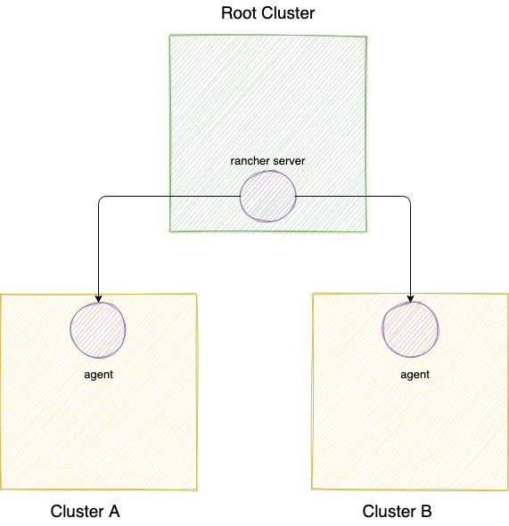
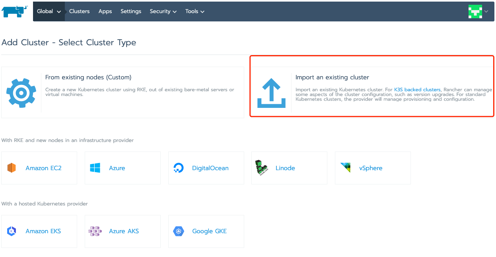
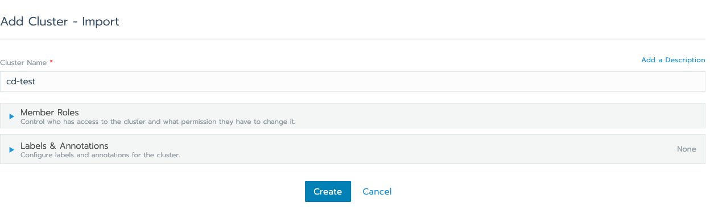
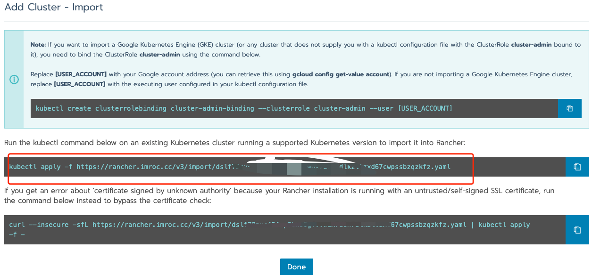
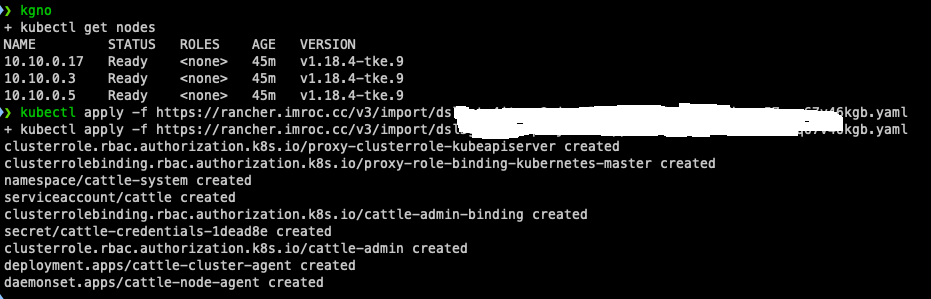
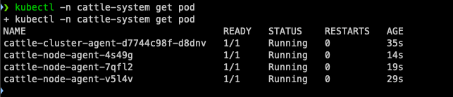
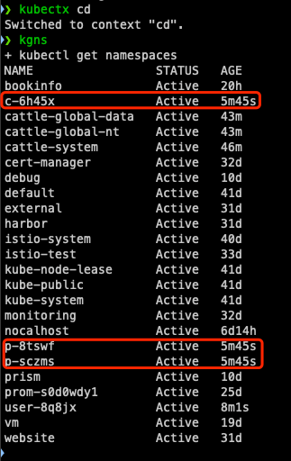
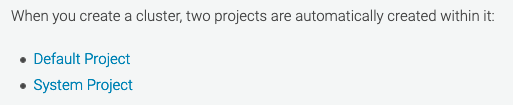
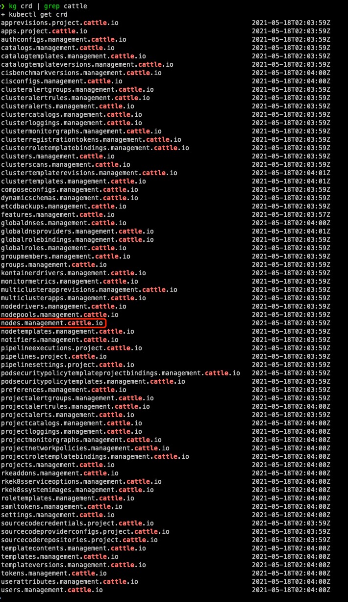

# 误删 rancher 的 namespace 导致 node 被清空

## 问题描述

集群的节点突然全都不见了 (`kubectl get node` 为空)，导致集群瘫痪，但实际上节点对应的虚拟机都还在。因为集群没开审计，所以也不太好查 node 是被什么删除的。

## 快速恢复

由于只是 k8s node 资源被删除，实际的机器都还在，我们可以批量重启节点，自动拉起 kubelet 重新注册 node，即可恢复。

## 可疑操作

发现在节点消失前，有个可疑的操作: 有同学发现在另外一个集群里有许多乱七八糟的 namespace (比如 `c-dxkxf`)，查看这些 namespace 中没有运行任何工作负载，可能是其它人之前创建的测试 namespace，就将其删除掉了。

## 分析

删除 namespace 的集群中安装了 rancher，怀疑被删除的 namespace 是 rancher 自动创建的。

rancher 管理了其它 k8s 集群，架构图:

猜想: 删除的 namespace 是 rancher 创建的，删除时清理了 rancher 的资源，也触发了 rancher 清理 node 的逻辑。

## 模拟复现

尝试模拟复现，验证猜想:
1. 创建一个 k8s 集群，作为 rancher 的 root cluster，并将 rancher 安装进去。
2. 进入 rancher web 界面，创建一个 cluster，使用 import 方式:

    

3. 输入 cluster name:

    

4. 弹出提示，让在另一个集群执行下面的 kubectl 命令将其导入到 rancher:

    

5. 创建另一个 k8s 集群作为被 rancher 管理的集群，并将 kubeconfig 导入本地以便后续使用 kubectl 操作。
6. 导入 kubeconfig 并切换 context 后，执行 rancher 提供的 kubectl 命令将集群导入 rancher:

    

    可以看到在被管理的 TKE 集群中自动创建了 cattle-system 命名空间，并运行一些 rancher 的 agent:

    

7. 将 context 切换到安装 rancher 的集群 (root cluster)，可以发现添加集群后，自动创建了一些 namespace: 1 个 `c-` 开头的，2 个 `p-` 开头的:

    

    猜想是 `c-` 开头的 namespace 被 rancher 用来存储所添加的 `cluster` 的相关信息；`p-` 用于存储 `project` 相关的信息，官方也说了会自动为每个 cluster 创建 2 个 project:

    

8. 查看有哪些 rancher 的 crd，有个 `nodes.management.cattle.io` 比较显眼，明显用于存储 cluster 的 node 信息:

    

9. 看下 node 存储在哪个 namespace (果然在 `c-` 开头的 namespace 中):

    

10. 尝试删除 `c-` 开头的 namesapce，并切换 context 到被添加的集群，执行 `kubectl get node`:

    

    节点被清空，问题复现。

## 结论

实验证明，rancher 的 `c-` 开头的 namespace 保存了所添加集群的 node 信息，如果删除了这种 namespace，也就删除了其中所存储的 node 信息，rancher watch 到了就会自动删除所关联集群的 k8s node 资源。

所以，千万不要轻易去清理 rancher 创建的 namespace，rancher 将一些有状态信息直接存储到了 root cluster 中 (通过 CRD 资源)，删除 namespace 可能造成很严重的后果。