# 调度器 cache 快照遗漏部分信息导致 pod pending

## 问题背景

新建一个如下的 k8s 集群，有3个master node和1个worker node（worker 和 master在不同的可用区），node信息如下：

| node | label信息 |
|:----|:----|
| master-01 | failure-domain.beta.kubernetes.io/region=sh,failure-domain.beta.kubernetes.io/zone=200002 |
| master-02 | failure-domain.beta.kubernetes.io/region=sh,failure-domain.beta.kubernetes.io/zone=200002 |
| master-03 | failure-domain.beta.kubernetes.io/region=sh,failure-domain.beta.kubernetes.io/zone=200002 |
| worker-node-01 | failure-domain.beta.kubernetes.io/region=sh,failure-domain.beta.kubernetes.io/zone=200004 |

待集群创建好之后，然后创建了一个daemonset对象，就出现了daemonset的某个pod一直卡主pending状态的现象。

现象如下：

```bash
$ kubectl  get  pod  -o  wide
NAME        READY STATUS  RESTARTS AGE NODE 
debug-4m8lc 1/1   Running 1        89m  master-01
debug-dn47c 0/1   Pending 0        89m  <none>
debug-lkmfs 1/1   Running 1        89m   master-02
debug-qwdbc 1/1   Running 1        89m  worker-node-01
```

## 结论先行

k8s的调度器在调度某个pod时，会从调度器的内部cache中同步一份快照（snapshot），其中保存了pod可以调度的node信息。

上面问题（daemonset的某个pod实例卡在pending状态）发生的原因就是同步的过程发生了部分node信息丢失，导致了daemonset的部分pod实例无法调度到指定的节点上，出现了pending状态。

接下来是详细的排查过程。

## 日志排查

截图中出现的节点信息（来自用户线上集群）：
* k8s master节点：ss-stg-ma-01、ss-stg-ma-02、ss-stg-ma-03
* k8s worker节点：ss-stg-test-01

1. 获取调度器的日志

这里首先是通过动态调大调度器的日志级别，比如，直接调大到`V(10)`，尝试获取一些相关日志。

当日志级别调大之后，有抓取到一些关键信息，信息如下：

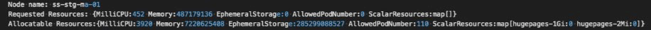

* 解释一下，当调度某个pod时，有可能会进入到调度器的抢占`preempt`环节，而上面的日志就是出自于抢占环节。 集群中有4个节点（3个master node和1个worker node），但是日志中只显示了3个节点，缺少了一个master节点。所以，这里暂时怀疑下是调度器内部缓存cache中少了`node info`。

2. 获取调度器内部cache信息

k8s v1.18已经支持打印调度器内部的缓存cache信息。打印出来的调度器内部缓存cache信息如下：


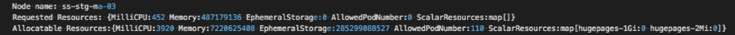

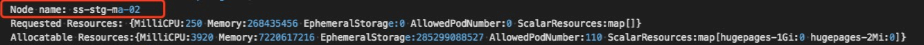

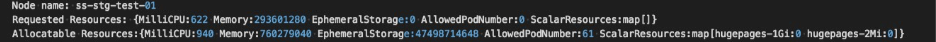

可以看出，调度器的内部缓存cache中的`node info`是完整的（3个master node和1个worker node）。

通过分析日志，可以得到一个初步结论：调度器内部缓存cache中的`node info`是完整的，但是当调度pod时，缓存cache中又会缺少部分node信息。

## 问题根因

在进一步分析之前，我们先一起再熟悉下调度器调度pod的流程（部分展示）和nodeTree数据结构。

### **pod调度流程（部分展示）**

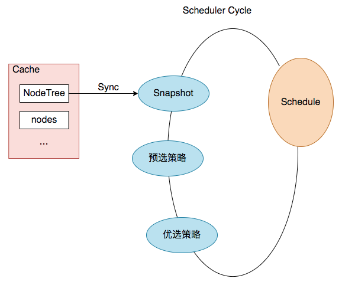

结合上图，一次pod的调度过程就是一次`Scheduler Cycle`。在这个`Cycle`开始时，第一步就是`update snapshot`。snapshot我们可以理解为cycle内的cache，其中保存了pod调度时所需的`node info`，而`update snapshot`，就是一次nodeTree（调度器内部cache中保存的node信息）到`snapshot`的同步过程。

而同步过程主要是通过`nodeTree.next()`函数来实现，函数逻辑如下：

```go
// next returns the name of the next node. NodeTree iterates over zones and in each zone iterates
// over nodes in a round robin fashion.
func (nt *nodeTree) next() string {
	if len(nt.zones) == 0 {
		return ""
	}
	numExhaustedZones := 0
	for {
		if nt.zoneIndex >= len(nt.zones) {
			nt.zoneIndex = 0
		}
		zone := nt.zones[nt.zoneIndex]
		nt.zoneIndex++
		// We do not check the exhausted zones before calling next() on the zone. This ensures
		// that if more nodes are added to a zone after it is exhausted, we iterate over the new nodes.
		nodeName, exhausted := nt.tree[zone].next()
		if exhausted {
			numExhaustedZones++
			if numExhaustedZones >= len(nt.zones) { // all zones are exhausted. we should reset.
				nt.resetExhausted()
			}
		} else {
			return nodeName
		}
	}
}
```

再结合上面排查过程得出的结论，我们可以再进一步缩小问题范围：nodeTree（调度器内部cache）到`snapshot.nodeInfoList`的同步过程丢失了某个节点信息。

### nodeTree数据结构

（方便理解，本文使用了链表来展示）

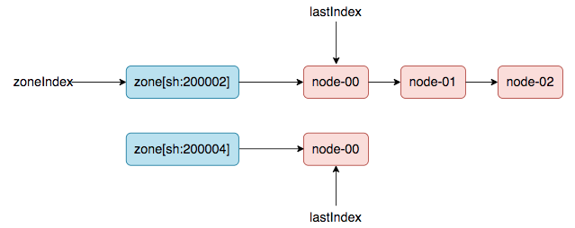

### 重现问题，定位根因

创建k8s集群时，会先加入master node，然后再加入worker node（意思是worker node时间上会晚于master node加入集群的时间）。

第一轮同步：3台master node创建好，然后发生pod调度（比如，cni 插件，以daemonset的方式部署在集群中），会触发一次nodeTree（调度器内部cache）到`snapshot.nodeInfoList`的同步。同步之后，nodeTree的两个游标就变成了如下结果：

`nodeTree.zoneIndex = 1, nodeTree.nodeArray[sh:200002].lastIndex = 3,`

第二轮同步：当worker node加入集群中后，然后新建一个daemonset，就会触发第二轮的同步（nodeTree（调度器内部cache）到`snapshot.nodeInfoList`的同步）。

同步过程如下：

1. zoneIndex=1, nodeArray[sh:200004].lastIndex=0, we get worker-node-01.

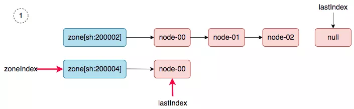

2. zoneIndex=2 >= len(zones); zoneIndex=0, nodeArray[sh:200002].lastIndex=3, return.

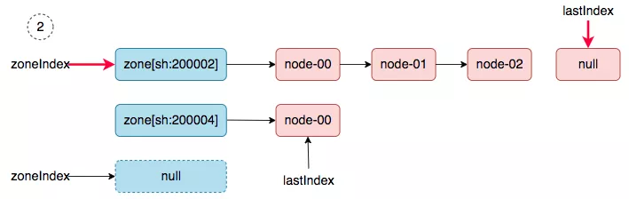

3. zoneIndex=1, nodeArray[sh:200004].lastIndex=1, return.

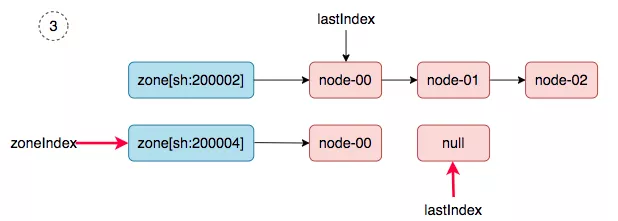

4. zoneIndex=0, nodeArray[sh:200002].lastIndex=0, we get master-01.

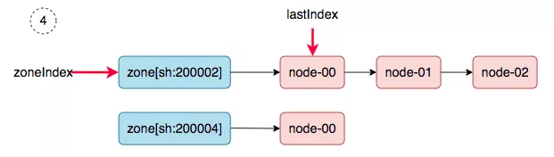

5. zoneIndex=1, nodeArray[sh:200004].lastIndex=0, we get worker-node-01.

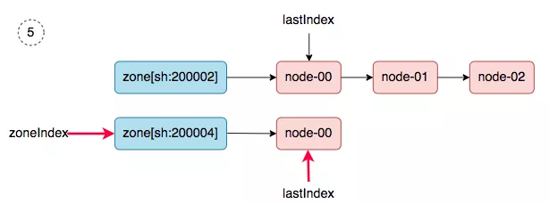

6. zoneIndex=2 >= len(zones); zoneIndex=0, nodeArray[sh:200002].lastIndex=1, we get master-02.

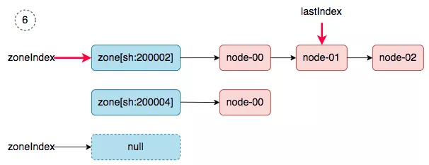

同步完成之后，调度器的`snapshot.nodeInfoList`得到如下的结果：

```json
[
    worker-node-01,
    master-01,
    worker-node-01,
    master-02,
]
```

master-03去哪了？在第二轮同步的过程中丢了。

## 解决方案

从`问题根因`的分析中，可以看出，导致问题发生的原因，在于nodeTree数据结构中的游标zoneIndex 和 lastIndex（zone级别）值被保留了，所以，解决的方案就是在每次同步SYNC时，强制重置游标（归0）。

## 参考资料

* [相关 issue](https://github.com/kubernetes/kubernetes/issues/97120)
* [相关pr (k8s v1.18)](https://github.com/kubernetes/kubernetes/pull/93387)
* [TKE 修复版本 v1.18.4-tke.5](https://cloud.tencent.com/document/product/457/9315#tke-kubernetes-1.18.4-revisions)
