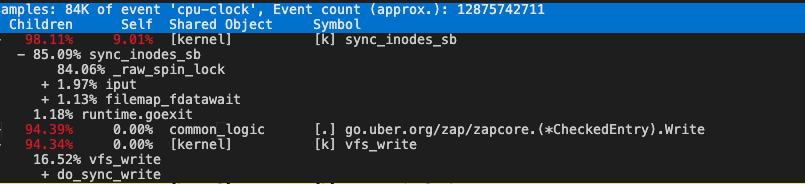
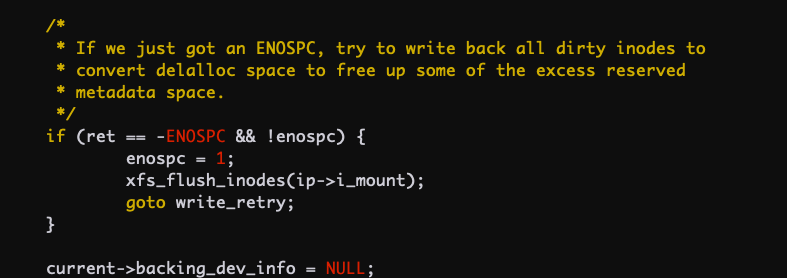
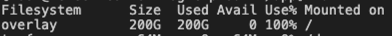
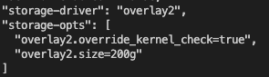

# 容器磁盘满导致 CPU 飙高

## 问题描述

某服务的其中两个副本异常，CPU 飙高。

## 排查

1. 查看 `container_cpu_usage_seconds_total` 监控，CPU 飙升，逼近 limit。
2. 查看 `container_cpu_cfs_throttled_periods_total` 监控，CPU 飙升伴随 CPU Throttle 飙升，所以服务异常应该是 CPU 被限流导致。
3. 查看 `container_cpu_system_seconds_total` 监控，发现 CPU 飙升主要是 CPU system 占用导致，容器内 `pidstat -u -t 5 1` 可以看到进程 `%system` 占用分布情况。
4. `perf top` 看 system 占用高主要是 `vfs_write` 写数据导致。

   

5. `iostat -xhd 2` 看 IO 并不高，磁盘利用率也不高，io wait 也不高。
6. `sync_inodes_sb` 看起来是写数据时触发了磁盘同步的耗时逻辑
7. 深入看内核代码，当磁盘满的时候会调用 flush 刷磁盘所有数据，这个会一直在内核态运行很久，相当于对这个文件系统做 sync。

   

8. 节点上 `df -h` 看并没有磁盘满。
9. 容器内 `df -h` 看根目录空间满了.

   

10. 看到 docker `daemon.json` 配置，限制了容器内 rootfs 最大只能占用 200G

    

11. 容器内一级级的 `du -sh *` 排查发现主要是一个 `nohup.log` 文件占满了磁盘。

## 结论

容器内空间满了继续写数据会导致内核不断刷盘对文件系统同步，会导致内核态 CPU 占用升高，设置了 cpu limit 通常会被 throttle，导致服务处理慢，影响业务。

## 建议

对日志进行轮转，或直接打到标准输出，避免写满容器磁盘。