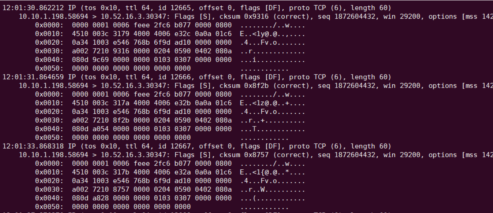
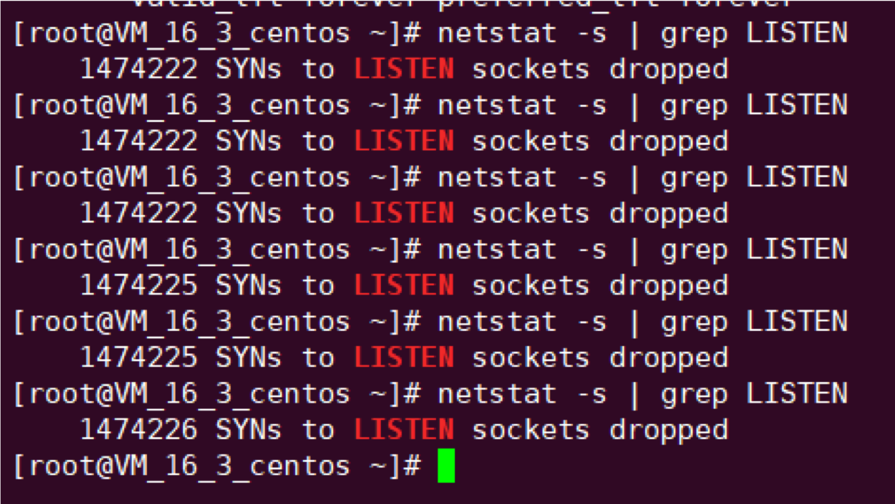

# tcp_tw_recycle 导致跨 VPC 访问 NodePort 超时

## 现象

从 VPC a 访问 VPC b 的 TKE 集群的某个节点的 NodePort，有时候正常，有时候会卡住直到超时。

## 排查

原因怎么查？

当然是先抓包看看啦，抓 server 端 NodePort 的包，发现异常时 server 能收到 SYN，但没响应 ACK:

反复执行 `netstat -s | grep LISTEN` 发现 SYN 被丢弃数量不断增加:

分析：

- 两个VPC之间使用对等连接打通的，CVM 之间通信应该就跟在一个内网一样可以互通。
- 为什么同一 VPC 下访问没问题，跨 VPC 有问题? 两者访问的区别是什么?

再仔细看下 client 所在环境，发现 client 是 VPC a 的 TKE 集群节点，捋一下:

- client 在 VPC a 的 TKE 集群的节点
- server 在 VPC b 的 TKE 集群的节点

因为 TKE 集群中有个叫 `ip-masq-agent` 的 daemonset，它会给 node 写 iptables 规则，默认 SNAT 目的 IP 是 VPC 之外的报文，所以 client 访问 server 会做 SNAT，也就是这里跨 VPC 相比同 VPC 访问 NodePort 多了一次 SNAT，如果是因为多了一次 SNAT 导致的这个问题，直觉告诉我这个应该跟内核参数有关，因为是 server 收到包没回包，所以应该是 server 所在 node 的内核参数问题，对比这个 node 和 普通 TKE node 的默认内核参数，发现这个 node `net.ipv4.tcp_tw_recycle = 1`，这个参数默认是关闭的，跟用户沟通后发现这个内核参数确实在做压测的时候调整过。

## tcp_tw_recycle 的坑

解释一下，TCP 主动关闭连接的一方在发送最后一个 ACK 会进入 `TIME_AWAIT` 状态，再等待 2 个 MSL 时间后才会关闭(因为如果 server 没收到 client 第四次挥手确认报文，server 会重发第三次挥手 FIN 报文，所以 client 需要停留 2 MSL的时长来处理可能会重复收到的报文段；同时等待 2 MSL 也可以让由于网络不通畅产生的滞留报文失效，避免新建立的连接收到之前旧连接的报文)，了解更详细的过程请参考 TCP 四次挥手。

参数 `tcp_tw_recycle` 用于快速回收 `TIME_AWAIT` 连接，通常在增加连接并发能力的场景会开启，比如发起大量短连接，快速回收可避免  `tw_buckets` 资源耗尽导致无法建立新连接 (`time wait bucket table overflow`)

查得 `tcp_tw_recycle` 有个坑，在 RFC1323 有段描述:

`
An additional mechanism could be added to the TCP, a per-host cache of the last timestamp received from any connection. This value could then be used in the PAWS mechanism to reject old duplicate segments from earlier incarnations of the connection, if the timestamp clock can be guaranteed to have ticked at least once since the old connection was open. This would require that the TIME-WAIT delay plus the RTT together must be at least one tick of the sender’s timestamp clock. Such an extension is not part of the proposal of this RFC.
`

大概意思是说 TCP 有一种行为，可以缓存每个连接最新的时间戳，后续请求中如果时间戳小于缓存的时间戳，即视为无效，相应的数据包会被丢弃。  

Linux 是否启用这种行为取决于 `tcp_timestamps` 和 `tcp_tw_recycle`，因为 `tcp_timestamps` 缺省开启，所以当 `tcp_tw_recycle` 被开启后，实际上这种行为就被激活了，当客户端或服务端以 `NAT` 方式构建的时候就可能出现问题。

当多个客户端通过 NAT 方式联网并与服务端交互时，服务端看到的是同一个 IP，也就是说对服务端而言这些客户端实际上等同于一个，可惜由于这些客户端的时间戳可能存在差异，于是乎从服务端的视角看，便可能出现时间戳错乱的现象，进而直接导致时间戳小的数据包被丢弃。如果发生了此类问题，具体的表现通常是是客户端明明发送的 SYN，但服务端就是不响应 ACK。

## 真相大白

回到我们的问题上，client 所在节点上可能也会有其它 pod 访问到 server 所在节点，而它们都被 SNAT 成了 client 所在节点的 NODE IP，但时间戳存在差异，server 就会看到时间戳错乱，因为开启了 `tcp_tw_recycle` 和 `tcp_timestamps` 激活了上述行为，就丢掉了比缓存时间戳小的报文，导致部分 SYN 被丢弃，这也解释了为什么之前我们抓包发现异常时 server 收到了 SYN，但没有响应 ACK，进而说明为什么 client 的请求部分会卡住直到超时。

由于 `tcp_tw_recycle` 坑太多，在内核 4.12 之后已移除: [remove tcp_tw_recycle](https://github.com/torvalds/linux/commit/4396e46187ca5070219b81773c4e65088dac50cc)

## 解决方案

1. 关闭 tcp_tw_recycle。
2. 升级内核，启用 `net.ipv4.tcp_tw_reuse`。