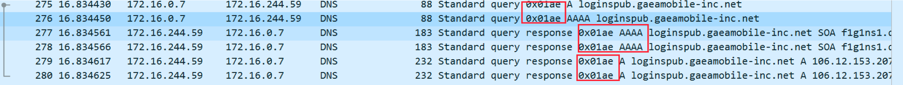

# dns id 冲突导致解析异常

## 现象

有个用户反馈域名解析有时有问题，看报错是解析超时。

## 排查

第一反应当然是看 coredns 的 log:

``` bash
[ERROR] 2 loginspub.xxxxmobile-inc.net.
A: unreachable backend: read udp 172.16.0.230:43742->10.225.30.181:53: i/o timeout
```

这是上游 DNS 解析异常了，因为解析外部域名 coredns 默认会请求上游 DNS 来查询，这里的上游 DNS 默认是 coredns pod 所在宿主机的 `resolv.conf` 里面的 nameserver (coredns pod 的 dnsPolicy 为 "Default"，也就是会将宿主机里的 `resolv.conf` 里的 nameserver 加到容器里的 `resolv.conf`, coredns 默认配置 `proxy . /etc/resolv.conf`, 意思是非 service 域名会使用 coredns 容器中 `resolv.conf` 文件里的 nameserver 来解析)

确认了下，超时的上游 DNS 10.225.30.181，并不是期望的 nameserver，VPC 默认 DNS 应该是 180 开头的。看了 coredns 所在节点的 `resolv.conf`，发现确实多出了这个非期望的 nameserver，跟用户确认了下，这个 DNS 不是用户自己加上去的，添加节点时这个 nameserver 本身就在 `resolv.conf` 中。

根据内部同学反馈， 10.225.30.181 是广州一台年久失修将被撤裁的 DNS，物理网络，没有 VIP，撤掉就没有了，所以如果 coredns 用到了这台 DNS 解析时就可能 timeout。后面我们自己测试，某些 VPC 的集群确实会有这个 nameserver，奇了怪了，哪里冒出来的？

又试了下直接创建 CVM，不加进 TKE 节点发现没有这个 nameserver，只要一加进 TKE 节点就有了 !!!

看起来是 TKE 的问题，将 CVM 添加到 TKE 集群会自动重装系统，初始化并加进集群成为 K8S 的 node，确认了初始化过程并不会写 `resolv.conf`，会不会是 TKE 的 OS 镜像问题？尝试搜一下除了 `/etc/resolv.conf` 之外哪里还有这个 nameserver 的 IP，最后发现 `/etc/resolvconf/resolv.conf.d/base` 这里面有。

看下 `/etc/resolvconf/resolv.conf.d/base` 的作用：Ubuntu 的 `/etc/resolv.conf` 是动态生成的，每次重启都会将 `/etc/resolvconf/resolv.conf.d/base`  里面的内容加到 `/etc/resolv.conf` 里。

经确认: 这个文件确实是 TKE 的 Ubuntu OS 镜像里自带的，可能发布 OS 镜像时不小心加进去的。

那为什么有些 VPC 的集群的节点 `/etc/resolv.conf` 里面没那个 IP 呢？它们的 OS 镜像里也都有那个文件那个 IP 呀。

请教其它部门同学发现:

- 非 dhcp 子机，cvm 的 cloud-init 会覆盖 `/etc/resolv.conf` 来设置 dns
- dhcp 子机，cloud-init 不会设置，而是通过 dhcp 动态下发
- 2018 年 4 月 之后创建的 VPC 就都是 dhcp 类型了的，比较新的 VPC 都是 dhcp 类型的

## 真相大白

`/etc/resolv.conf` 一开始内容都包含 `/etc/resolvconf/resolv.conf.d/base` 的内容，也就是都有那个不期望的 nameserver，但老的 VPC 由于不是 dhcp 类型，所以 cloud-init 会覆盖 `/etc/resolv.conf`，抹掉了不被期望的 nameserver，而新创建的 VPC 都是 dhcp 类型，cloud-init 不会覆盖 `/etc/resolv.conf`，导致不被期望的 nameserver 残留在了 `/etc/resolv.conf`，而 coredns pod 的 dnsPolicy 为 “Default”，也就是会将宿主机的 `/etc/resolv.conf` 中的 nameserver 加到容器里，coredns 解析集群外的域名默认使用这些 nameserver 来解析，当用到那个将被撤裁的 nameserver 就可能 timeout。

## 解决方案

临时解决: 删掉 `/etc/resolvconf/resolv.conf.d/base` 重启。
长期解决: 我们重新制作 TKE Ubuntu OS 镜像然后发布更新。

## 再次出问题

这下应该没问题了吧，But, 用户反馈还是会偶尔解析有问题，但现象不一样了，这次并不是 dns timeout。

用脚本跑测试仔细分析现象:

- 请求 `loginspub.xxxxmobile-inc.net` 时，偶尔提示域名无法解析
- 请求 `accounts.google.com` 时，偶尔提示连接失败

进入 dns 解析偶尔异常的容器的 netns 抓包:

- dns 请求会并发请求 A 和 AAAA 记录
- 测试脚本发请求打印序号，抓包然后 wireshark 分析对比异常时请求序号偏移量，找到异常时的 dns 请求报文，发现异常时 A 和 AAAA 记录的请求 id 冲突，并且 AAAA 响应先返回



正常情况下id不会冲突，这里冲突了也就能解释这个 dns 解析异常的现象了:

- `loginspub.xxxxmobile-inc.net` 没有 AAAA (ipv6) 记录，它的响应先返回告知 client 不存在此记录，由于请求 id 跟 A 记录请求冲突，后面 A 记录响应返回了 client 发现 id 重复就忽略了，然后认为这个域名无法解析
- `accounts.google.com` 有 AAAA 记录，响应先返回了，client 就拿这个记录去尝试请求，但当前容器环境不支持 ipv6，所以会连接失败

## 分析

那为什么 dns 请求 id 会冲突?

继续观察发现: 其它节点上的 pod 不会复现这个问题，有问题这个节点上也不是所有 pod 都有这个问题，只有基于 alpine 镜像的容器才有这个问题，在此节点新起一个测试的 `alpine:latest` 的容器也一样有这个问题。

为什么 alpine 镜像的容器在这个节点上有问题在其它节点上没问题？ 为什么其他镜像的容器都没问题？它们跟 alpine 的区别是什么？

发现一点区别: alpine 使用的底层 c 库是 musl libc，其它镜像基本都是 glibc

翻 musl libc 源码, 构造 dns 请求时，请求 id 的生成没加锁，而且跟当前时间戳有关 (`network/res_mkquery.c`):

``` c
/* Make a reasonably unpredictable id */
clock_gettime(CLOCK_REALTIME, &ts);
id = ts.tv_nsec + ts.tv_nsec/65536UL & 0xffff;
```

看注释，作者应该认为这样id基本不会冲突，事实证明，绝大多数情况确实不会冲突，我在网上搜了很久没有搜到任何关于 musl libc 的 dns 请求 id 冲突的情况。这个看起来取决于硬件，可能在某种类型硬件的机器上运行，短时间内生成的 id 就可能冲突。我尝试跟用户在相同地域的集群，添加相同配置相同机型的节点，也复现了这个问题，但后来删除再添加时又不能复现了，看起来后面新建的 cvm 又跑在了另一种硬件的母机上了。

OK，能解释通了，再底层的细节就不清楚了，我们来看下解决方案:

- 换基础镜像 (不用alpine)
- 完全静态编译业务程序(不依赖底层c库)，比如go语言程序编译时可以关闭 cgo (CGO_ENABLED=0)，并告诉链接器要静态链接 (`go build` 后面加 `-ldflags '-d'`)，但这需要语言和编译工具支持才可以

## 最终解决方案

最终建议用户基础镜像换成另一个比较小的镜像: `debian:stretch-slim`。
