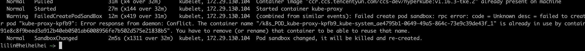
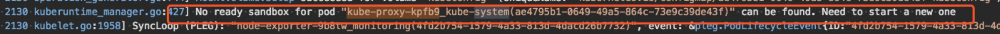
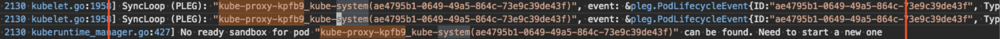
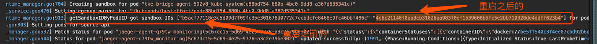
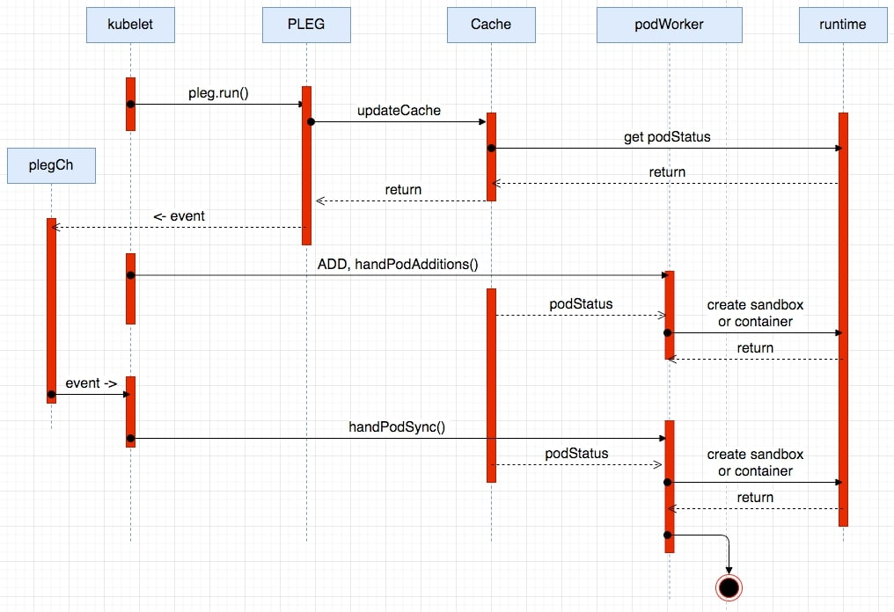
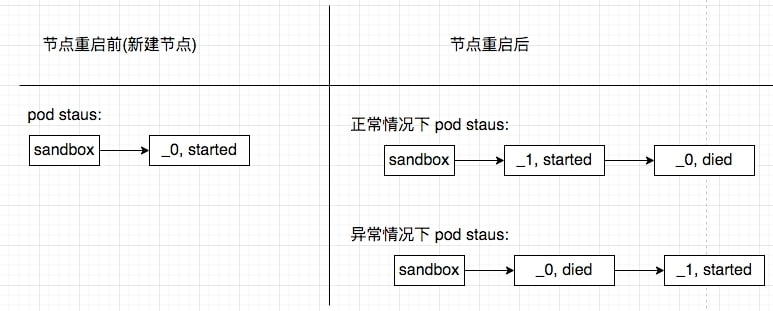

# 系统时间被修改导致 sandbox 冲突

## 问题描述

节点重启后，节点上的存量 pod 出现无法正常 running，容器（sandbox）在不断重启的现象。

查看事件，提示是 sandbox 的 name 存在冲突 (`The container name xxx is already used by yyy`)，具体事件如下：



## 结论先行

这个问题的根因是节点的时间问题，节点重启前的系统时间比节点重启后的系统时间提前，影响了 kubelet 内部缓存 cache 中的 sandbox 的排序，导致 kubelet 每次起了一个新 sandbox 之后，都只会拿到旧的 sandbox，导致了 sandbox 的不断创建和 name 冲突。

## 排查日志

先来看下 kubelet 的日志，部分截图如下：





截图上是同一个 pod（kube-proxy）最近的两次 podWorker 逻辑截图，都抛出了同一个提示：`No ready sandbox for pod <pod-name> can be found, Need to start a new one`。这个应该就是造成容器冲突的来源，每次沉浸到 podWorker 的逻辑之后，podWorker 都要尝试去创建一个新的sandbox，进而造成容器冲突。

疑问：为啥 podWorker 每次都去创建一个新的 sandbox?

接下来继续调大 kubelet 的日志级别（k8s v1.16已经支持动态调整，这里调大日志级别到V(6))，这里主要是尝试拿到某个 pod 所关联的所有 sandbox，截图如下：



通过配合节点上执行 docker inspect（ps）相关命令发现，异常的 pod（kube-proxy）存在两个 sandbox（重启前的+重启后的），并且在 sandboxID 数组中的排序为 `[重启前的sandbox, 重启后的 sandbox]` (这里先 mark 一下)。

## 相关知识

在进一步分析之前，我们先介绍下相关背景知识。

### Pod 创建流程

先来一起熟悉下 pod 创建流程:



### PLEG 组件

再看下 `PLEG` 的工作流程。kubelet 启动之后，会运行起 `PLEG` 组件，定期的缓存 pod 的信息（包括 pod status）。在 `PLEG` 的每次 relist 逻辑中，会对比 `old pod` 和 `new pod`，检查是否存在变化，如果新旧 pod 之间存在变化，则开始执行下面两个逻辑：
1. 生成 event 事件，比如 containerStart 等，最后再投递到 `eventChannel` 中，供 podWorker 来消费。
2. 更新内部缓存 cache。在跟新缓存 `updateCache` 的逻辑中，会调用 runtime 的相关接口获取到与 pod 相关的 status 状态信息，然后并缓存到内部缓存 cache中，最后发起通知 ( podWorker 会发起订阅) 。

podStatus的数据结构如下：

```go
# podStatus
type PodStatus struct {
	// ID of the pod.
	ID types.UID
        ...
        ...
	// Only for kuberuntime now, other runtime may keep it nil.
	SandboxStatuses []*runtimeapi.PodSandboxStatus
}

# SandboxStatus
// PodSandboxStatus contains the status of the PodSandbox.
type PodSandboxStatus struct {
	// ID of the sandbox.
	Id string `protobuf:"bytes,1,opt,name=id,proto3" json:"id,omitempty"`
        ...
	// Creation timestamp of the sandbox in nanoseconds. Must be > 0.
	CreatedAt int64 `protobuf:"varint,4,opt,name=created_at,json=createdAt,proto3" json:"created_at,omitempty"`
        ...
}
```

podStatus 会保存 pod 的一些基础信息，再加上 containerStatus 和 sandboxStatus 信息。

这里重点关注下 SandboxStatus 的排序问题，配合代码可以发现，排序是按照 sandbox 的 Create time 来执行的，并且时间越新，位置越靠前。排序相关的代码部分如下：

```go
// Newest first.
type podSandboxByCreated []*runtimeapi.PodSandbox

func (p podSandboxByCreated) Len() int           { return len(p) }
func (p podSandboxByCreated) Swap(i, j int)      { p[i], p[j] = p[j], p[i] }
func (p podSandboxByCreated) Less(i, j int) bool { return p[i].CreatedAt > p[j].CreatedAt }
```

### podWorker 组件

最后再看下 podWorker 的工作流程。podWorker 的工作就是负责 pod 在节点上的正确运行（比如挂载 volume，新起 sandbox，新起 container 等），一个 pod 对应一个 podWorker，直到 pod 销毁。当节点重启后，kubelet 会收到 `type=ADD` 的事件来创建 pod 对象。

当 pod 更新之后，会触发 `event=containerStart` 事件的投递，然后 kubelet 就会收到 `type=SYNC` 的事件，来更新 pod 对象。在每次 podWorker 的内部逻辑中（`managePodLoop()`) 中，会存在一个 podStatus（内部缓存）的订阅，如下：

```go
// This is a blocking call that would return only if the cache
// has an entry for the pod that is newer than minRuntimeCache
// Time. This ensures the worker doesn't start syncing until
// after the cache is at least newer than the finished time of
// the previous sync.
status, err := p.podCache.GetNewerThan(podUID, lastSyncTime)
```

来等待内部 cache 中的 podStatus 更新，然后再操作后续动作（是否重新挂载 volume、是否重建 sandbox，是否重建 container 等）。

## 复现问题，定位根因

接下来，我们一起来模拟复现下问题现场。



在节点重启之前，由于是新建节点后，所以对于 pod 来说，status 中只有一个命名以 `_0` 结尾的 sandbox。当操作重启节点之后，kubelet 收到 `type=ADD` 的事件，podWorker 开始创建 pod，由于之前以 `_0` 命名结尾的 sandbox 已经 died 了，所以会新建一个新的以 `_1` 命名结尾的 sandbox，当新的以 `_1` 命名结尾的 sandbox 运行之后（containerStarted），就会投递一个 `type=SYNC` 的事件给到 kubelet，然后 podWorker 会被再次触发（内部 cache 也更新了，通知也发出了）。正常情况下，podWorker 会拿到 podStatus 中新的 sandbox（以 `_1` 命名结尾的），就不会再创建 sandbox 了，也就是不会发生 name 冲突的问题。而用户的环境却是，此时拿到了以 `_0` 命名结尾的旧的 sandbox，所以再新一轮的 podWorker 逻辑中，会再次创建一个新的以 `_1` 命名的 sandbox，从而产生冲突。

而这里的根因就是时间问题，节点重启前的sandbox（以 `_0` 命名结尾的）的 `create time` ，比节点重启后的sandbox（以 `_1` 命名结尾的）的 `create time` 还要提前，所以导致了内部 cache 中 sandbox 的排序发生了错乱，从而触发 name 冲突问题。

## 解决方案

根据上面的排查发现，kubelet 的内部缓存中，sandbox 的排序是有系统时间来决定的，所以，尽量保证 k8s 集群中的时间有正确同步，或者不要乱改节点上的时间。