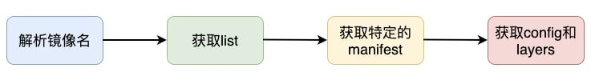

# 高版本 containerd 下载镜像失败

## 问题描述

在 containerd 运行时的 kubernetes 线上环境中，出现了镜像无法下载的情况，具体报错如下：

```txt
Failed to pull image&nbsp;`  `"ccr.ccs.tencentyun.com/tkeimages/tke-hpc-controller:v1.0.0"`  `: rpc error: code = NotFound desc = failed to pull and unpack image&nbsp;`  `"ccr.ccs.tencentyun.com/tkeimages/tke-hpc-controller:v1.0.0"`  `: failed to unpack image on snapshotter overlayfs: failed to extract layer sha256:d72a74c56330b347f7d18b64d2effd93edd695fde25dc301d52c37efbcf4844e: failed to get reader from content store: content digest sha256:2bf487c4beaa6fa7ea6e46ec1ff50029024ebf59f628c065432a16a940792b58: not found
```

containerd 的日志中也有相关日志：

```txt
containerd[136]: time="2020-11-19T16:11:56.975489200Z" level=info msg="PullImage \"redis:2.8.23\""
containerd[136]: time="2020-11-19T16:12:00.140053300Z" level=warning msg="reference for unknown type: application/octet-stream" digest="sha256:481995377a044d40ca3358e4203fe95eca1d58b98a1d4c2d9cec51c0c4569613" mediatype=application/octet-stream size=5946
```

## 尝试复现

分析环境信息:

* container v1.4.3 运行时。
* 基于 1.10 版本的 docker 制作的镜像（比如 dockerhub 镜像仓库中的 redis:2.8.23）。

然后根据以上版本信息构造相同环境，通过如下命令拉取镜像：

```bash
$ crictl pull docker.io/libraryredis:2.8.23
FATA[0001] pulling image failed: rpc error: code = NotFound desc = failed to pull and unpack image "docker.io/library/redis:2.8.23": failed to unpack image on snapshotter overlayfs: failed to extract layer sha256:4dcab49015d47e8f300ec33400a02cebc7b54cadd09c37e49eccbc655279da90: failed to get reader from content store: content digest sha256:51f5c6a04d83efd2d45c5fd59537218924bc46705e3de6ffc8bc07b51481610b: not found
```

问题复现，基本确认跟 containerd 版本与打包镜像的 docker 版本有关。

## 分析镜像下载的过程

在 containerd 运行时环境中，完整拉取一个镜像，主要会经历以下几步，如图所示：



接下来以 `centos:latest` 镜像的拉取过程为例。

1. 将镜像名解析成 oci 规范里 descriptor

主要是 HEAD 请求，并且记录下返回中的 `Content-Type` 和 `Docker-Content-Digest`:

```bash
$ curl -v -X HEAD -H "Accept: application/vnd.docker.distribution.manifest.v2+json, application/vnd.docker.distribution.manifest.list.v2+json, application/vnd.oci.image.manifest.v1+json, application/vnd.oci.image.index.v1+json, */*" https://mirror.ccs.tencentyun.com/v2/library/centos/manifests/latest?ns=docker.io
...
< HTTP/1.1 200 OK
< Date: Mon, 17 May 2021 11:53:29 GMT
< Content-Type: application/vnd.docker.distribution.manifest.list.v2+json
< Content-Length: 762
< Connection: keep-alive
< Docker-Content-Digest: sha256:5528e8b1b1719d34604c87e11dcd1c0a20bedf46e83b5632cdeac91b8c04efc1
```

2. 获取镜像的 list 列表:

```bash
$ curl -X GET -H "Accept: application/vnd.docker.distribution.manifest.list.v2+json"  https://mirror.ccs.tencentyun.com/v2/library/centos/manifests/sha256:5528e8b1b1719d34604c87e11dcd1c0a20bedf46e83b5632cdeac91b8c04efc1
{
    "manifests":[
        {
            "digest":"sha256:dbbacecc49b088458781c16f3775f2a2ec7521079034a7ba499c8b0bb7f86875",
            "mediaType":"application\/vnd.docker.distribution.manifest.v2+json",
            "platform":{
                "architecture":"amd64",
                "os":"linux"
            },
            "size":529
        },
        {
            "digest":"sha256:7723d6b5d15b1c64d0a82ee6298c66cf8c27179e1c8a458e719041ffd08cd091",
            "mediaType":"application\/vnd.docker.distribution.manifest.v2+json",
            "platform":{
                "architecture":"arm64",
                "os":"linux",
                "variant":"v8"
            },
            "size":529
        },
        ...
    "mediaType":"application\/vnd.docker.distribution.manifest.list.v2+json",
    "schemaVersion":2
}
```

3. 获取特定操作系统上的镜像 manifest。由于宿主机的环境是 linux，所以 `containerd` 会选择适合该平台的镜像进行拉取:

```bash
$ curl -X GET -H "Accept: application/vnd.docker.distribution.manifest.v2+json"  https://mirror.ccs.tencentyun.com/v2/library/centos/manifests/sha256:dbbacecc49b08458781c16f3775f2a2ec7521079034a7ba499c8b0bb7f86875
{
   "schemaVersion": 2,
   "mediaType": "application/vnd.docker.distribution.manifest.v2+json",
   "config": {
      "mediaType": "application/vnd.docker.container.image.v1+json",
      "size": 2143,
      "digest": "sha256:300e315adb2f96afe5f0b2780b87f28ae95231fe3bdd1e16b9ba606307728f55"
   },
   "layers": [
      {
         "mediaType": "application/vnd.docker.image.rootfs.diff.tar.gzip",
         "size": 75181999,
         "digest": "sha256:7a0437f04f83f084b7ed68ad9c4a4947e12fc4e1b006b38129bac89114ec3621"
      }
   ]
}
```

5. 拉取镜像的 config 和 layers。最后一步就是解析第三步中获取的 manifest，分别再下载镜像的 config 和 layers 就可以。

## 关于 mediaType：application/octet-stream

`mediaType：application/octet-stream` 是 docker 较早（docker v1.10 之前）支持的 `docker/oci` 标准，现在已经不支持了，而社区也任务该 mediaType 也太老了，所以 containerd 后续也就不再支持了 (详情可以参考 PR [#5497](https://github.com/containerd/containerd/pull/5497)) 。

## 定位根因

接下来以 `redis:2.8.23` 镜像的拉取过程为例说明一下拉取失败的原因。

1. 将镜像名解析成 OCI 规范里 descriptor。这里还是 HEAD 请求，但返回中的 `Content-Type` 已经不是 list 类型了，而是 `application/vnd.docker.distribution.manifest.v2+json`:

```bash
$ curl -v -X HEAD -H "Accept: application/vnd.docker.distribution.manifest.v2+json, application/vnd.docker.distribution.manifest.list.v2+json, application/vnd.oci.image.manifest.v1+json, application/vnd.oci.image.index.v1+json, */*" https://mirror.ccs.tencentyun.com/v2/library/redis/manifests/2.8.23?ns=docker.io
...
< HTTP/1.1 200 OK
< Date: Thu, 20 May 2021 02:25:08 GMT
< Content-Type: application/vnd.docker.distribution.manifest.v2+json 
< Content-Length: 1968
< Connection: keep-alive
< Docker-Content-Digest: sha256:e507029ca6a11b85f8628ff16d7ff73ae54582f16fd757e64431f5ca6d27a13c
```

2. 直接解析 manifest。因为 HEAD 请求中返回的是 manifest 类型，而不是 list 类型，所以这里会直接解析，解析出的 config 的 mediaType 是 `application/octet-stream`:

```bash
$ curl -X GET -H "Accept: application/vnd.docker.distribution.manifest.v2+json"  https://mirror.ccs.tencentyun.com/v2/library/redis/manifests/sha256:e507029ca6a11b85f8628ff16d7ff73ae54582f16fd757e64431f5ca6d27a13c
{
   "schemaVersion": 2,
   "mediaType": "application/vnd.docker.distribution.manifest.v2+json",
   "config": {
      "mediaType": "application/octet-stream", # 这里的 mediaType 是 application/octet-stream
      "size": 5946,
      "digest": "sha256:481995377a044d40ca3358e4203fe95eca1d58b98a1d4c2d9cec51c0c4569613"
   },
   "layers": [
      {
         "mediaType": "application/vnd.docker.image.rootfs.diff.tar.gzip",
         "size": 51356334,
         "digest": "sha256:51f5c6a04d83efd2d45c5fd59537218924bc46705e3de6ffc8bc07b51481610b"
      },
      ...
   ]
```

3. containerd 中已经不支持 `mediaType: application/octet-stream`。 在 unpacker 逻辑中， containerd 已经不再支持 `mediaType: application/octet-stream`，导致了不会再下载 layers，故而出错。具体代码在 `containerd/unpacker.go` 中：

```go
    case images.MediaTypeDockerSchema2Config, ocispec.MediaTypeImageConfig:
```

## 解决方案

如果遇到该问题，应基于新的 dockerd 运行时（>= docker v1.11）来重新构建镜像，并推送到镜像仓库中。

## 疑问：为什么 containerd v1.3.4 版本支持，而新版 v1.4.3 版本却不支持 ？

在 containerd v1.3.4 的版本中，合进了 [PR #2814：bugfix: support application/octet-stream during pull](https://github.com/containerd/containerd/pull/2814) ，支持了 `mediaType：application/octet-stream` 镜像格式的下载。

而在 v1.4.3 中，包含 [PR #3870](https://github.com/containerd/containerd/pull/3870) ，又去掉了对 `mediaType：application/octet-stream` 镜像格式的支持，导致了 v1.3.4 和 v1.4.3 版本的行为不一致。