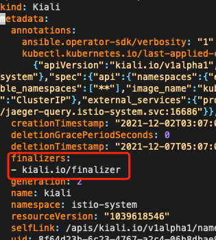

# Namespace 一直 Terminating

## 概述

本文分享 namespace 一直卡在 terminating 状态的可能原因与解决方法。

## Namespace 上存在 Finalizers 且对应软件已卸载

删除 ns 后，一直卡在 Terminating 状态。通常是存在 finalizers，通过 `kubectl get ns xxx -o yaml` 可以看到是否有 finalizers:

``` bash
$ kubectl get ns -o yaml kube-node-lease
apiVersion: v1
kind: Namespace
metadata:
...
  finalizers:
  - finalizers.kubesphere.io/namespaces
  labels:
    kubesphere.io/workspace: system-workspace
  name: kube-node-lease
  ownerReferences:
  - apiVersion: tenant.kubesphere.io/v1alpha1
    blockOwnerDeletion: true
    controller: true
    kind: Workspace
    name: system-workspace
    uid: d4310acd-1fdc-11ea-a370-a2c490b9ae47
spec: {}
```

此例是因为之前装过 kubesphere，然后卸载了，但没有清理 finalizers，将其删除就可以了。

k8s 资源的 metadata 里如果存在 finalizers，那么该资源一般是由某应用创建的，或者是这个资源是此应用关心的。应用会在资源的 metadata 里的 finalizers 加了一个它自己可以识别的标识，这意味着这个资源被删除时需要由此应用来做删除前的清理，清理完了它需要将标识从该资源的 finalizers 中移除，然后才会最终彻底删除资源。比如 Rancher 创建的一些资源就会写入 finalizers 标识。

如果应用被删除，而finalizer没清理，删除资源时就会一直卡在terminating，可以手动删除finalizer来解决。

手动删除方法：
1. `kubectl edit ns xx` 删除 `spec.finalizers`。
2. 如果k8s版本较高会发现方法1行不通，因为高版本更改 namespace finalizers 被移到了 namespace 的 finalize 这个 subresource (参考[官方文档API文档](https://github.com/kubernetes/community/blob/master/contributors/design-proposals/architecture/namespaces.md#rest-api))，并且需要使用 `PUT` 请求，可以先执行 `kubectl proxy` 然后再起一个终端用 curl 模拟请求去删 `finalizers`:
``` bash
curl -H "Content-Type: application/json" -XPUT -d '{"apiVersion":"v1","kind":"Namespace","metadata":{"name":"delete-me"},"spec":{"finalizers":[]}}' http://localhost:8001/api/v1/namespaces/delete-me/finalize
```
> 替换 `delete-me` 为你的 namespace 名称

参考资料:

* Node Lease 的 Proposal: https://github.com/kubernetes/enhancements/blob/master/keps/sig-node/0009-node-heartbeat.md

## Namespace 中残留的资源存在 Finalizers 且相应软件已卸载

查看 namespace yaml:

```bash
$ kubectl get ns istio-system -o yaml
...
status:
  conditions:
  - lastTransitionTime: "2021-12-07T05:07:14Z"
    message: 'Some resources are remaining: kialis.kiali.io has 1 resource instances'
    reason: SomeResourcesRemain
    status: "True"
    type: NamespaceContentRemaining
  - lastTransitionTime: "2021-12-07T05:07:14Z"
    message: 'Some content in the namespace has finalizers remaining: kiali.io/finalizer
      in 1 resource instances'
    reason: SomeFinalizersRemain
    status: "True"
    type: NamespaceFinalizersRemaining
  phase: Terminating
```

可以看到 `SomeResourcesRemain` 和 `SomeFinalizersRemain`，对应资源类型是 `kialis.kiali.io`，可以获取看一下:

```bash
$ kubectl -n istio-system get kialis.kiali.io
NAME    AGE
kiali   5d23h
```

这个例子明显看是安装过 kiali，且有 kiali 残留的 crd 资源，但 kiali 已卸载。
清理 namespace 时清理 kiali 资源时，发现资源上存在 finilizer，需等待 kiali 本身进一步清理，由于 kiali 已卸载就无法清理，导致一直在等待。

这个时候我们可以手动删下资源上的 finalizer 即可:

```bash
kubectl -n istio-system edit kialis.kiali.io kiali
```



## metrics server 被删除

删除 ns 时，apiserver 会调注册上去的扩展 api 去清理资源，如果扩展 api 对应的服务也被删了，那么就无法清理完成，也就一直卡在 Terminating。

下面的例子就是使用 prometheus-adapter 注册的 resource metrics api，但 prometheus-adapter 已经被删除了:

``` bash
$ kubectl get apiservice
...
v1beta1.metrics.k8s.io                 monitoring/prometheus-adapter     False (ServiceNotFound)   75d
...
```


## 强删 namespace 方法

有时候实在找不到原因，也可以强删 namespace，以下是强删方法:

```bash
NAMESPACE=delete-me
kubectl get ns $NAMESPACE -o json | jq '.spec.finalizers=[]' > ns.json
kubectl proxy --port=8899 &
PID=$!
curl -X PUT http://localhost:8899/api/v1/namespaces/$NAMESPACE/finalize -H "Content-Type: application/json" --data-binary @ns.json
kill $PID
```