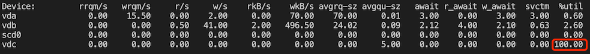

# IO 高负载

系统如果出现 IO WAIT 高，说明 IO 设备的速度跟不上 CPU 的处理速度，CPU 需要在那里干等，这里的等待实际也占用了 CPU 时间，导致系统负载升高，可能就会影响业务进程的处理速度，导致业务超时。

## 如何判断 ？

使用 `top` 命令看下当前负载：

```text
top - 19:42:06 up 23:59,  2 users,  load average: 34.64, 35.80, 35.76
Tasks: 679 total,   1 running, 678 sleeping,   0 stopped,   0 zombie
Cpu(s): 15.6%us,  1.7%sy,  0.0%ni, 74.7%id,  7.9%wa,  0.0%hi,  0.1%si,  0.0%st
Mem:  32865032k total, 30989168k used,  1875864k free,   370748k buffers
Swap:  8388604k total,     5440k used,  8383164k free,  7982424k cached

  PID USER      PR  NI  VIRT  RES  SHR S %CPU %MEM    TIME+  COMMAND
 9783 mysql     20   0 17.3g  16g 8104 S 186.9 52.3   3752:33 mysqld
 5700 nginx     20   0 1330m  66m 9496 S  8.9  0.2   0:20.82 php-fpm
 6424 nginx     20   0 1330m  65m 8372 S  8.3  0.2   0:04.97 php-fpm
```

`%wa` (wait) 表示 IO WAIT 的 cpu 占用，默认看到的是所有核的平均值，要看每个核的 `%wa` 值需要按下 "1":

```text
top - 19:42:08 up 23:59,  2 users,  load average: 34.64, 35.80, 35.76
Tasks: 679 total,   1 running, 678 sleeping,   0 stopped,   0 zombie
Cpu0  : 29.5%us,  3.7%sy,  0.0%ni, 48.7%id, 17.9%wa,  0.0%hi,  0.1%si,  0.0%st
Cpu1  : 29.3%us,  3.7%sy,  0.0%ni, 48.9%id, 17.9%wa,  0.0%hi,  0.1%si,  0.0%st
Cpu2  : 26.1%us,  3.1%sy,  0.0%ni, 64.4%id,  6.0%wa,  0.0%hi,  0.3%si,  0.0%st
Cpu3  : 25.9%us,  3.1%sy,  0.0%ni, 65.5%id,  5.4%wa,  0.0%hi,  0.1%si,  0.0%st
Cpu4  : 24.9%us,  3.0%sy,  0.0%ni, 66.8%id,  5.0%wa,  0.0%hi,  0.3%si,  0.0%st
Cpu5  : 24.9%us,  2.9%sy,  0.0%ni, 67.0%id,  4.8%wa,  0.0%hi,  0.3%si,  0.0%st
Cpu6  : 24.2%us,  2.7%sy,  0.0%ni, 68.3%id,  4.5%wa,  0.0%hi,  0.3%si,  0.0%st
Cpu7  : 24.3%us,  2.6%sy,  0.0%ni, 68.5%id,  4.2%wa,  0.0%hi,  0.3%si,  0.0%st
Cpu8  : 23.8%us,  2.6%sy,  0.0%ni, 69.2%id,  4.1%wa,  0.0%hi,  0.3%si,  0.0%st
Cpu9  : 23.9%us,  2.5%sy,  0.0%ni, 69.3%id,  4.0%wa,  0.0%hi,  0.3%si,  0.0%st
Cpu10 : 23.3%us,  2.4%sy,  0.0%ni, 68.7%id,  5.6%wa,  0.0%hi,  0.0%si,  0.0%st
Cpu11 : 23.3%us,  2.4%sy,  0.0%ni, 69.2%id,  5.1%wa,  0.0%hi,  0.0%si,  0.0%st
Cpu12 : 21.8%us,  2.4%sy,  0.0%ni, 60.2%id, 15.5%wa,  0.0%hi,  0.0%si,  0.0%st
Cpu13 : 21.9%us,  2.4%sy,  0.0%ni, 60.6%id, 15.2%wa,  0.0%hi,  0.0%si,  0.0%st
Cpu14 : 21.4%us,  2.3%sy,  0.0%ni, 72.6%id,  3.7%wa,  0.0%hi,  0.0%si,  0.0%st
Cpu15 : 21.5%us,  2.2%sy,  0.0%ni, 73.2%id,  3.1%wa,  0.0%hi,  0.0%si,  0.0%st
Cpu16 : 21.2%us,  2.2%sy,  0.0%ni, 73.6%id,  3.0%wa,  0.0%hi,  0.0%si,  0.0%st
Cpu17 : 21.2%us,  2.1%sy,  0.0%ni, 73.8%id,  2.8%wa,  0.0%hi,  0.0%si,  0.0%st
Cpu18 : 20.9%us,  2.1%sy,  0.0%ni, 74.1%id,  2.9%wa,  0.0%hi,  0.0%si,  0.0%st
Cpu19 : 21.0%us,  2.1%sy,  0.0%ni, 74.4%id,  2.5%wa,  0.0%hi,  0.0%si,  0.0%st
Cpu20 : 20.7%us,  2.0%sy,  0.0%ni, 73.8%id,  3.4%wa,  0.0%hi,  0.0%si,  0.0%st
Cpu21 : 20.8%us,  2.0%sy,  0.0%ni, 73.9%id,  3.2%wa,  0.0%hi,  0.0%si,  0.0%st
Cpu22 : 20.8%us,  2.0%sy,  0.0%ni, 74.4%id,  2.8%wa,  0.0%hi,  0.0%si,  0.0%st
Cpu23 : 20.8%us,  1.9%sy,  0.0%ni, 74.4%id,  2.8%wa,  0.0%hi,  0.0%si,  0.0%st
Mem:  32865032k total, 30209248k used,  2655784k free,   370748k buffers
Swap:  8388604k total,     5440k used,  8383164k free,  7986552k cached
```

`wa` 通常是 0%，如果经常在 1% 之上，说明存储设备的速度已经太慢，无法跟上 cpu 的处理速度。

## 如何排查 ？

### 使用 iostat 检查设备是否 hang 住

```bash
iostat -xhd 2
```

如果有 100% 的 `%util` 的设备，说明该设备基本 hang 住了



### 观察高 IO 的磁盘读写情况

```bash
# 捕获 %util 超过 90 时 vdb 盘的读写指标，每秒检查一次
while true; do iostat -xhd | grep -A1 vdb | grep -v vdb | awk '{if ($NF > 90){print $0}}'; sleep 1s; done
```

如果读写流量或 IOPS 不高，但 `%util` 不高，通常是磁盘本身有问题了，需要检查下磁盘。 在云上托管的 k8s 集群通常就使用的云厂商的云盘(比如腾讯云CBS)，可以拿到磁盘 ID 反馈下。

如果读写流量或 IOPS 高，继续下面的步骤排查出哪些进程导致的 IO 高负载。

### 查看哪些进程占住磁盘

```bash
fuser -v -m /dev/vdb
```

### 查找 D 状态的进程

D 状态 (Disk Sleep) 表示进程正在等待 IO，不可中断，正常情况下不会保持太久，如果进程长时间处于 D 状态，通常是设备故障

```bash
ps -eo pid,ppid,stat,command

## 捕获 D 状态的进程
while true; do ps -eo pid,ppid,stat,command | awk '{if ($3 ~ /D/) {print $0}}'; sleep 0.5s; done
```

### 观察高 IO 进程

```bash
iotop -oP
# 展示 I/O 统计，每秒更新一次
pidstat -d 1
# 只看某个进程
pidstat -d 1 -p 3394470
```

### 使用 ebpf 抓高 IOPS 进程

安装 bcc-tools:
```bash
yum install -y bcc-tools
```

分析:
```bash
$ cd /usr/share/bcc/tools
$ ./biosnoop 5 > io.txt
$ cat io.txt | awk '{print $3,$2,$4,$5}' | sort | uniq -c | sort -rn | head -10
   6850 3356537 containerd vdb R
   1294 3926934 containerd vdb R
    864 1670 xfsaild/vdb vdb W
    578 3953662 kworker/u180:1 vda W
    496 3540267 logsys_cfg_cli vdb R
    459 1670 xfsaild/vdb vdb R
    354 3285936 php-fpm vdb R
    340 3285934 php-fpm vdb R
    292 2952592 sap1001 vdb R
    273 324710 python vdb R
$ pstree -apnhs 3356537
systemd,1 --switched-root --system --deserialize 22
  └─containerd,3895
      └─{containerd},3356537    
$ timeout 10 strace -fp 3895 > strace.txt 2>&1
# vdb 的 IOPS 高，vdb 挂载到了 /data 目录，这里过滤下 "/data"
$ grep "/data" strace.txt | tail -10
[pid 19562] newfstatat(AT_FDCWD, "/data/containerd/io.containerd.snapshotter.v1.overlayfs/snapshots/6974/fs/data/log/monitor/snaps/20211010/ps-2338.log", {st_mode=S_IFREG|0644, st_size=6509, ...}, AT_SYMLINK_NOFOLLOW) = 0
[pid 19562] newfstatat(AT_FDCWD, "/data/containerd/io.containerd.snapshotter.v1.overlayfs/snapshots/6974/fs/data/log/monitor/snaps/20211010/ps-2339.log", {st_mode=S_IFREG|0644, st_size=6402, ...}, AT_SYMLINK_NOFOLLOW) = 0
[pid 19562] newfstatat(AT_FDCWD, "/data/containerd/io.containerd.snapshotter.v1.overlayfs/snapshots/6974/fs/data/log/monitor/snaps/20211010/ps-2340.log", {st_mode=S_IFREG|0644, st_size=6509, ...}, AT_SYMLINK_NOFOLLOW) = 0
[pid 19562] newfstatat(AT_FDCWD, "/data/containerd/io.containerd.snapshotter.v1.overlayfs/snapshots/6974/fs/data/log/monitor/snaps/20211010/ps-2341.log", {st_mode=S_IFREG|0644, st_size=6509, ...}, AT_SYMLINK_NOFOLLOW) = 0
[pid 19562] newfstatat(AT_FDCWD, "/data/containerd/io.containerd.snapshotter.v1.overlayfs/snapshots/6974/fs/data/log/monitor/snaps/20211010/ps-2342.log", {st_mode=S_IFREG|0644, st_size=6970, ...}, AT_SYMLINK_NOFOLLOW) = 0
[pid 19562] newfstatat(AT_FDCWD, "/data/containerd/io.containerd.snapshotter.v1.overlayfs/snapshots/6974/fs/data/log/monitor/snaps/20211010/ps-2343.log", {st_mode=S_IFREG|0644, st_size=6509, ...}, AT_SYMLINK_NOFOLLOW) = 0
[pid 19562] newfstatat(AT_FDCWD, "/data/containerd/io.containerd.snapshotter.v1.overlayfs/snapshots/6974/fs/data/log/monitor/snaps/20211010/ps-2344.log", {st_mode=S_IFREG|0644, st_size=6402, ...}, AT_SYMLINK_NOFOLLOW) = 0
[pid 19562] newfstatat(AT_FDCWD, "/data/containerd/io.containerd.snapshotter.v1.overlayfs/snapshots/6974/fs/data/log/monitor/snaps/20211010/ps-2345.log",  <unfinished ...>
[pid 19562] newfstatat(AT_FDCWD, "/data/containerd/io.containerd.snapshotter.v1.overlayfs/snapshots/6974/fs/data/log/monitor/snaps/20211010/ps-2346.log", {st_mode=S_IFREG|0644, st_size=7756, ...}, AT_SYMLINK_NOFOLLOW) = 0
[pid 19562] newfstatat(AT_FDCWD, "/data/containerd/io.containerd.snapshotter.v1.overlayfs/snapshots/6974/fs/data/log/monitor/snaps/20211010/ps-2347.log", Process 3895 detached
$ grep "/data" strace.txt > data.txt
# 合并且排序，自行用脚本分析下哪些文件操作多
$ cat data.txt | awk -F '"' '{print $2}' | sort | uniq -c | sort -n > data-sorted.txt
```